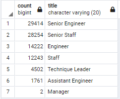

# Challenge 7

## Overview of the analysis
Through out this challenge we learned how to set up a data base, populate it, make an ERD, and query it. All this to help make tables for a company that will be jhaving a lot of people retiring soon

## Results

- There will be a lot of higher ups retiring, many senior staff members are elegible to leave the company.

- Almost 40% of the company is available to retire
- The mentorship program has a lot of potential candidates
- Theres over 1500 people elgible for the program

## Summary
### How many roles will need to be filled as the "silver tsunami" begins to make an impact?
90,398 roles, almost 60% are senior titles.

### Are there enough qualified, retirement-ready employees in the departments to mentor the next generation of Pewlett Hackard employees?
There are some, not enough, although theres over 1500 posible mentors, there are over 90 thousand roles to be filled up
